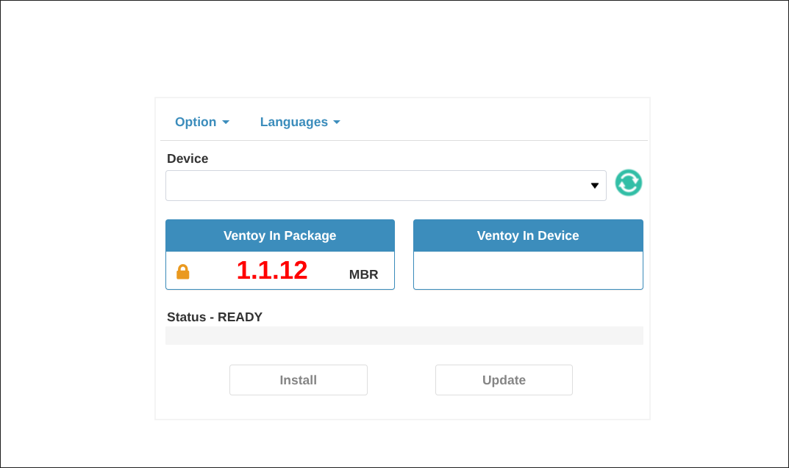

# Ventoy

# Table of contents

- [0 Why Ventoy?](#0-why-ventoy)<br>
  - [0.1 Notes](#01-notes)<br>
- [1 Installing the Ventoy package](#1-installing-the-ventoy-package)<br>
- [2 Installing Ventoy on a USB stick](#2-installing-ventoy-on-a-usb-stick)<br>
  - [2.1 Installing via GUI](#21-installing-via-gui)<br>
  - [2.2 Installing via CLI](#22installing-via-cli)<br>
- [3 Copying ISO files to your Ventoy usb stick](#3-copying-iso-files-to-your-ventoy-usb-stick)<br>
- [4 Booting from your Ventoy USB stick](#4-booting-from-your-ventoy-usb-stick)<br>

# 0 Why Ventoy?

You've been distro hopping a lot lately, but one day you ran out of USB sticks. You think of buying a new one, but is it really worth it to waste a USB stick every time you want to make a bootable drive? Wouldn't the world be a better place if you could have multiple ISO files on one bootable USB stick?<br>
And that is exactly the problem Ventoy solves.

## 0.1 Notes

- You can see which ISO files where tested with Venoty [here](https://www.ventoy.net/en/isolist.html).
- If an ISO file you want to use isn't supported yet don't lose hope; the projects gets updated frequently and with each update more ISO files are supported. To update Ventoy on your USB stick (let's say sdb) run: ``` ventoy -u /dev/sdb ```. Updating Ventoy doesn't affect the ISO files aready installed.

# 1 Installing the Ventoy package

Download it via your package manager if you have it. On Arch the package is in the AUR (ventoy or ventoy-bin),
Else you can install the package from [here](https://sourceforge.net/projects/ventoy/files/v1.1.12/).<br>
Select the linux.tar.gz option (if you are on linux obviously)
and after it finishes the download do:<br>
``` tar -xf <downloaded file name> ```

# 2 Installing Ventoy on a USB stick
Now it is time to actually install Ventoy. There are two alternative methods to do so: using the GUI and using the CLI

## 2.1 Installing via GUI

Start ventoygui from the command line (if you installed it via package manager) or execute the VentoyGUI.x86_64 file (if you downloaded and extracted the .tar.gz file from the download link).<br>
You should see something like this:

Insert your USB stick/drive, click the refresh icon, select your drive, click install and let it do its thing

## 2.2Installing via CLI

Insert your USB drive.<br><br>
If you installed ventoy via package manager, run:
``` # ventoy -i /dev/sdx ```
where sdx is your drive. (run ```lsblk``` to identify which disk block is which). Note that you need to run the ventoy command as sudo. <br><br>
If you installed ventoy via download link run the Ventoy2Disk.sh script as follows:
``` # ./Ventoy2Disk.sh -i /dev/sdx ```
where sdx is your USB drive. (run ```lsblk``` to indentify which disk block is which). Note that you need to run the ventoy command as sudo.

# 3 Copying ISO files to your Ventoy USB stick

Finally, to "write" your ISO files to the USB stick, simply open your file manager, copy the ISO file and paste it onto the USB stick (now labelled Ventoy)

# 4 Booting from your Ventoy USB stick

To boot from your Ventoy USB stick/drive you need to start/restart your device while the USB drive is inserted, keep tapping the "boot menu key" while your device is in the firmware boot phase and select the name of the drive that has Ventoy on it.<br>
You will now be prompted to select which ISO -from the ones you copied to the Ventoy USB stick- you want to boot from.